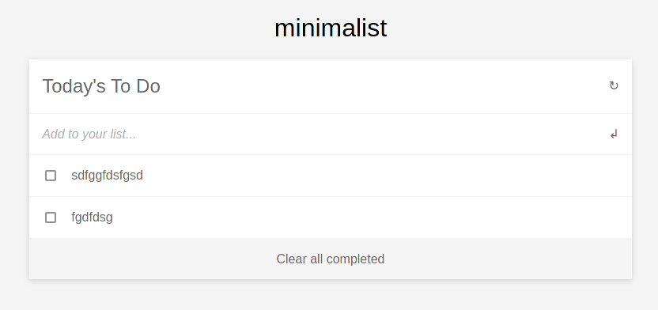

# To_Do_list

> Website that allows users to add/remove tasks from a list.

This is achieved by using JavaScript objects and arrays. Also, the DOM is dynamically modified.

"To-do list" is a tool that helps to organize your day. It simply lists the things that you need to do and allows you to mark them as complete. This is a simple website that allows for doing just that; it was built using ES6 and Webpack!

## Built With

- Javascript
- HTML5
- CSS3

## Live Demo

[Live Demo Link](https://alexhamn.github.io/To_Do_List_1/)

## Future Updates & Roadmap:

- Complete website with styles

## Getting Started:

To get a local copy up and running follow these simple example steps:

### Setup

1. Under the repository name, click 'Clone' or download clicking the green button.

2. Copy the URL given by clicking the clipboard button

3. Open a terminal window in your local machine and change the current directory to the one you want the clone directory to be made.

4. Type  git clone and the paste the URL you previously copied to the clipboard

5. Change the current directory to the newly created folder

6. Now open the index.html file on your browser. You can add and remove tasks which persist on browser reloads.

## Authors

👤 **Alex Gamino**

- GitHub: [@alexhamn](https://github.com/AlexHamn)
- LinkedIn: [AlexGamino](https://linkedin.com/in/alex-gamino-81aab3214/)

## 🤝 Contributing

Contributions, issues, and feature requests are welcome!

Feel free to check the [issues page](https://github.com/AlexHamn/capstone1/issues).

## Show your support

Give a ⭐️ if you like this project!

## Acknowledgments

- Reproduction of the [minimalist website](https://web.archive.org/web/20180320194056/http://www.getminimalist.com:80/). That website is already offline but you can still play with thanks to web.archive.org.

## 📝 License

This project is [MIT](LICENSE.md) licensed.